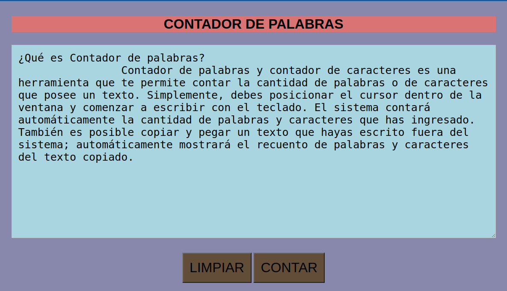

# Contador Básico de Palabras.

Descripción:

---

Este programa es uno de los primeros proyectos desarrollados en respuesta a un trabajo solicitado por el instituto. Se trata de un contador básico de palabras que proporciona el número total de palabras utilizadas en un texto ingresado por el usuario. Además, presenta una lista de las palabras más repetidas dentro del texto.

---

## Funcionalidades Clave

- Contar la cantidad de palabras en un texto ingresado por el usuario.
- Contar la cantidad de caracteres (incluyendo espacios) en el texto.
- Contar la cantidad de oraciones y párrafos en el texto.

## Tecnologías Utilizadas

- HTML: para la estructura de la página.
- CSS: para el diseño y estilo visual.
- JavaScript: para implementar la lógica de conteo y análisis del texto.

## Cómo Utilizar

1. Accede a la página web desde [este enlace](https://luis-alberto-espinoza.github.io/Contador_de_Palabras/).
2. Escribe o pega un texto en el cuadro de texto proporcionado.
3. Haz clic en el botón "Contar" para obtener los resultados.

## Inspiración e Historia

Este proyecto surgió como una manera de practicar mis habilidades en desarrollo web y aprender más sobre el lenguaje JavaScript. Aunque es un proyecto en proceso y puede que esté incompleto, tengo muchas ganas de remasterizarlo y agregar más funcionalidades en el futuro.

## Resultados Esperados

Espero que esta herramienta sea útil para cualquier persona que necesite contar palabras y caracteres en un texto de manera rápida y sencilla. Además, la función de mostrar las palabras más utilizadas y su densidad puede ayudar a mejorar la redacción y estructura del texto.

## Capturas de Pantalla

## Futuras Mejoras a Implementar:

- Refactorizar el código para mejorar su estructura y modularidad.
- Implementar comentarios más descriptivos para facilitar la comprensión.
- Aplicar buenas prácticas de nomenclatura para hacer el código más legible.
- Validar el texto ingresado para evitar errores con caracteres especiales.
- Agregar pruebas unitarias para asegurar el correcto funcionamiento del programa.
- Mejorar el diseño y la presentación de los resultados en la interfaz.

## Contribuciones

Si deseas contribuir a este proyecto, ¡eres bienvenido! Puedes hacerlo a través de pull requests en GitHub.

## Autor

Nombre: Luis Alberto Espinoza.
Correo electrónico: espinoza.luis.alberto1981@gmail.com

## Agradecimientos

Quiero agradecer a mis profesores y compañeros por su apoyo y guía en este proyecto. También quiero agradecer a la comunidad de desarrollo web por sus recursos y tutoriales, que me han ayudado a aprender y mejorar mis habilidades.

¡Gracias por explorar este proyecto y espero que disfrutes utilizando el Contador de Palabras y Caracteres!
