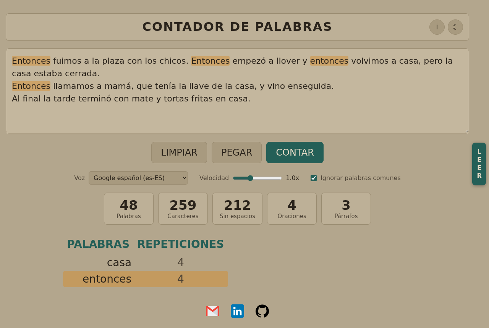
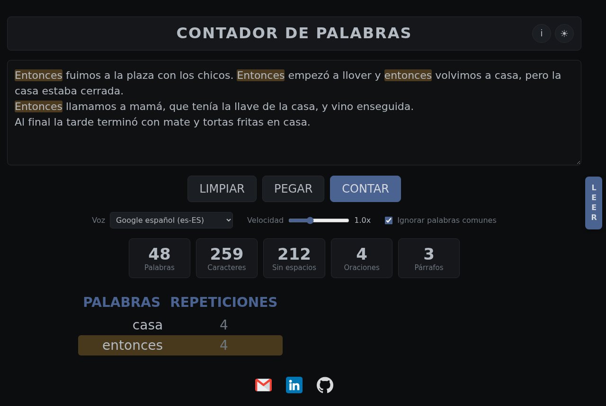

# Contador de Palabras

Descripción:

---

Este programa empezó como uno de los primeros proyectos desarrollados en respuesta a un trabajo solicitado por el instituto: un contador básico de palabras. Con el tiempo fue creciendo y hoy, además de contar, ayuda a **revisar y mejorar un texto**: muestra qué palabras se repiten, las resalta dentro del texto y lo puede leer en voz alta.

---

## Funcionalidades

### Conteo
- Cantidad de **palabras**, **caracteres** (con y sin espacios), **oraciones** y **párrafos**, cada uno en su tarjeta.
- Solo cuentan como palabras las letras y números (con acentos y ñ). Los símbolos sueltos como `)`, `¿`, `«»` o `...` se ignoran. Las palabras con guion o apóstrofo, como "teórico-práctico" u "O'Higgins", cuentan como una sola.
- Tabla de **palabras repetidas**, ordenada de mayor a menor.
- Opción **Ignorar palabras comunes**: saca de la tabla "de", "la", "que", "el", "en"... para que se vean las repeticiones que realmente importan.
- **Click en una palabra de la tabla**: se resaltan todas sus apariciones en el texto. Otro click apaga el resaltado.

### Lectura en voz alta
- Botón **LEER** fijo en el margen derecho, siempre a mano. Mientras lee cambia a **PAUSAR**, y en pausa a **SEGUIR**.
- La oración que se está leyendo queda marcada y la página se desplaza sola para que siempre quede a la vista.
- Si se selecciona una parte del texto antes de apretar LEER, lee **desde ahí hasta el final**.
- Se puede elegir la **voz** y la **velocidad** (de 0.5x a 2x). En Chrome se usa por defecto la voz de Google en español.

### Comodidad
- **Tema claro y oscuro**, con colores de bajo contraste para no cansar la vista. La primera vez se usa el tema del sistema y después se recuerda el elegido.
- La caja de texto ocupa todo el espacio libre de la pantalla y **crece** sola si el texto es largo.
- Botón **PEGAR**: reemplaza el contenido de la caja por lo que haya en el portapapeles.
- **Doble click** en una zona vacía de la caja, o afuera de ella, selecciona todo el texto.
- Al contar, la página baja sola hasta los resultados. Botón **↑** para volver arriba.
- Botón **i** con los atajos y trucos de selección.
- Se recuerdan las preferencias: tema, voz, velocidad y palabras comunes.

## Atajos de teclado

| Tecla | Acción |
|---|---|
| `Ctrl + Enter` | Contar |
| `Alt + L` | Leer, pausar y seguir |
| `Esc` | Pausar la lectura |
| `Alt + R` | Quitar el resaltado de palabras |

## Cómo Utilizar

1. Accede a la página web desde [este enlace](https://luis-alberto-espinoza.github.io/Contador_de_Palabras/), o abre `index.html` en el navegador.
2. Escribe o pega un texto en la caja.
3. Haz clic en **CONTAR** (o `Ctrl + Enter`) para ver los resultados.
4. Haz clic en una palabra de la tabla para verla resaltada en el texto, o en **LEER** para escucharlo.

## Compatibilidad

- **Lectura en voz alta:** funciona mejor en **Chrome**, que trae la voz "Google español". Firefox usa las voces del sistema operativo (en Linux suenan bastante robóticas). En Brave la voz de Google aparece pero no suena, porque Brave bloquea los servicios de Google: hay que elegir otra voz de la lista.
- **Botón PEGAR:** por seguridad, el navegador pide permiso para leer el portapapeles. Chrome lo pregunta una vez por sitio; Firefox lo pregunta cada vez. `Ctrl + V` siempre funciona sin preguntar.

## Tecnologías Utilizadas

- HTML: para la estructura de la página.
- CSS: para el diseño, los temas claro/oscuro (variables CSS) y la adaptación a celulares.
- JavaScript: para la lógica de conteo y análisis del texto, sin librerías externas.
- Web Speech API: para la lectura en voz alta.
- Clipboard API: para el botón PEGAR.

## Inspiración e Historia

Este proyecto surgió como una manera de practicar mis habilidades en desarrollo web y aprender más sobre el lenguaje JavaScript. Empezó como un contador básico y lo fui remasterizando para agregarle funcionalidades que lo hicieran realmente útil a la hora de escribir.

## Capturas de Pantalla

Tema claro:

Tema oscuro:

## Futuras Mejoras a Implementar

- Actualizar el conteo mientras se escribe, sin tener que apretar CONTAR.
- Mostrar el tiempo estimado de lectura.
- Mostrar el porcentaje (densidad) de cada palabra repetida.
- Guardar el texto automáticamente para no perderlo si se cierra la pestaña.
- Cargar un archivo `.txt` arrastrándolo a la caja.
- Meta de palabras con barra de progreso (útil para trabajos con mínimo o máximo de palabras).
- Refactorizar el conteo de repetidas y quitar código que ya no se usa.
- Agregar pruebas unitarias para asegurar el correcto funcionamiento del programa.

## Contribuciones

Si deseas contribuir a este proyecto, ¡eres bienvenido! Puedes hacerlo a través de pull requests en GitHub.

## Autor

Nombre: Luis Alberto Espinoza.
Correo electrónico: espinoza.luis.alberto1981@gmail.com

## Agradecimientos

Quiero agradecer a mis profesores y compañeros por su apoyo y guía en este proyecto. También quiero agradecer a la comunidad de desarrollo web por sus recursos y tutoriales, que me han ayudado a aprender y mejorar mis habilidades.

¡Gracias por explorar este proyecto y espero que disfrutes utilizando el Contador de Palabras!
